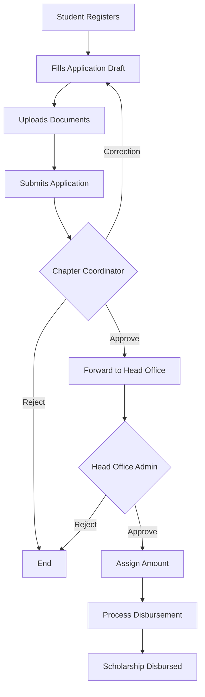

<div align="center">
  <h1>🎓 NSF Scholarship Management System</h1>
  <p>A comprehensive MERN stack platform for streamlining scholarship applications, multi-tier reviews, and fund disbursements.</p>
</div>

<br />

## 🌟 Overview

The **National Scholarship Foundation (NSF) System** provides an end-to-end digital workflow for scholarship processing. By replacing paper-based approvals with a secure, role-based digital portal, the system ensures transparency, speed, and accuracy from the moment a student applies to the final bank disbursement.

---

## ✨ Key Features

- 🔐 **Role-Based Access Control:** Secure, isolated portals tailored for Students, Chapter Coordinators, Head Office Admins, and Super Admins.
- 📝 **Smart Application Flow:** Students can save drafts, upload requisite documents, and track their application progress via an interactive timeline.
- 🔄 **Multi-Tier Verification:** Built-in review processes allow Chapter Coordinators to request corrections before escalating to the Head Office for final sanctioning.
- 💸 **Disbursement Tracking:** Dedicated tools for the Head Office to record and track bank transfer reference numbers.
- 📁 **Document Management:** Seamless integration for uploading and previewing certificates and bank details.

---

## 🛠️ Technology Stack

**Frontend**
- **Framework:** React.js (Vite)
- **Styling:** Tailwind CSS
- **Icons:** Lucide React
- **Routing:** React Router DOM

**Backend**
- **Environment:** Node.js & Express.js
- **Database:** MongoDB & Mongoose
- **Authentication:** JSON Web Tokens (JWT) & bcryptjs
- **File Uploads:** Multer

---

## 🚀 Getting Started

### Prerequisites
- Node.js (v16 or higher)
- MongoDB running locally or a MongoDB Atlas URI

### 1. Backend Setup

Open a terminal and navigate to the backend directory:
```bash
cd backend
npm install
```

Create a `.env` file in the `backend` folder with the following variables:
```env
PORT=5000
MONGO_URI=mongodb://127.0.0.1:27017/student-management
JWT_SECRET=your_super_secret_jwt_key
```

### 2. Database Seeding

To quickly test the platform, populate the database with demo users and chapters:
```bash
node seed.js
```

Start the backend server:
```bash
npm run dev
```

### 3. Frontend Setup

Open a new terminal window and navigate to the frontend directory:
```bash
cd frontend
npm install
npm run dev
```

The application should now be accessible at `http://localhost:5173`.

---

## 🔑 Demo Credentials

If you ran the seed script, you can log in immediately using the unified login portal. 

**Password for all accounts:** `password123`

| Role | Email Address | Capabilities |
| :--- | :--- | :--- |
| **Student** | `student@example.com` | Create applications, upload files, check status. |
| **Chapter Coordinator** | `delhi@nsf.org` | Review applications submitted to the Delhi NCR chapter. |
| **Head Office** | `headoffice@nsf.org` | Final application approval, amount assignment, and disbursement. |
| **Super Admin** | `admin@nsf.org` | Create regional chapters, assign coordinators, and manage/delete users. |

---

## 🏗️ Folder Structure

```text
student-management-system/
├── backend/                  # Express server & APIs
│   ├── controllers/          # Business logic (Auth, Apps, Admin)
│   ├── middleware/           # JWT verification & Multer config
│   ├── models/               # Mongoose database schemas
│   ├── routes/               # API endpoint definitions
│   └── uploads/              # Local storage for user documents
│
└── frontend/                 # React application
    └── src/
        ├── components/       # Global UI (Sidebar, Layouts)
        ├── context/          # React Context (Auth State)
        ├── pages/            # Role-specific dashboard views
        └── services/         # Axios interceptors for API calls
```

---

## 🔄 Application Workflow



---
## ScreenShots
   student login
     
   student application form 
       

   student dashboard and tracking
     
   Chapter coordinator dashboard 
       
   chapter coordinator review 
    
   head office dashboard  
     
   head office review 
     
    head office Sanction amount
      
    headoffice paying amount/ Disbursement 
      
    head office paid
       
    head office  dashboard after paying amount
      
   admin dashboard
    
    admin edit / add  a chapter 
     
  admin user management
    
  student after getting amount  dashboard
     

   
## 📑 API Reference

### Authentication
- `POST /api/auth/register` - Create a new account
- `POST /api/auth/login` - Authenticate user & get token
- `GET /api/auth/me` - Get current user profile

### Student Applications
- `GET /api/applications/chapters` - List available chapters
- `POST /api/applications` - Save application draft
- `GET /api/applications/my` - Fetch user's application
- `POST /api/applications/:id/submit` - Final submission
- `POST /api/applications/:id/documents` - Upload files

### Management (Coordinator & Head Office)
- `GET /api/coordinator/applications` - View chapter applications
- `POST /api/coordinator/applications/:id/review` - Review/Correction action
- `GET /api/head-office/applications` - View all forwarded apps
- `POST /api/head-office/applications/:id/assign-amount` - Set scholarship value

---

## 🛤️ Roadmap

- [ ] **Email Notifications:** Automatic alerts for status changes.
- [ ] **Cloud Storage:** Transition from local storage to AWS S3 / Cloudinary.
- [ ] **Analytics:** Interactive charts for Super Admin using Recharts.
- [ ] **Audit Logs:** Track every action taken on an application for transparency.

---
*Built with modern web standards to empower educational accessibility.*
